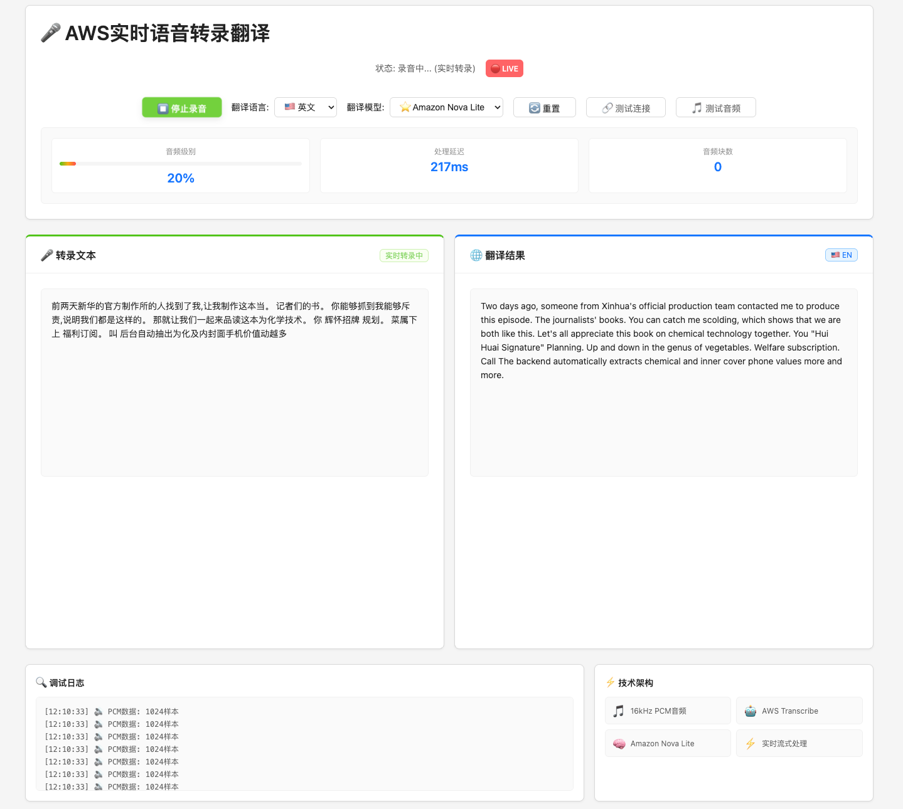

# AWS实时语音转录翻译应用

基于AWS服务的实时语音转录和翻译应用，支持多语言识别和AI翻译。


[英语-n.mov](%E8%8B%B1%E8%AF%AD-n.mov)

## 🏗️ 架构

### Web版本
- **前端**: React.js + S3 + CloudFront
- **后端**: ECS Fargate + ALB  + Global Accelerator
- **AI服务**: AWS Transcribe + Amazon Bedrock (Claude 3.5 Haiku / Nova Lite)

### macOS原生客户端 🆕
- **客户端**: Swift + SwiftUI原生应用
- **AI服务**: AWS Transcribe Streaming直接集成（无需后端服务器）
- **安全存储**: macOS Keychain存储AWS凭证
- **音频处理**: AVFoundation原生音频捕获

## 低延迟的建议部署方案
1. 后端建议和TranscribeStreamingClient 调用的region在同一个地方
2. 后端建议通过AGA进行加速

## 📁 项目结构

```
asr-real-time/
├── README.md                       # 项目说明
├── backend/
│   ├── streaming_transcribe_server.py  # HTTP服务器
│   └── requirements.txt                 # Python依赖
├── frontend/
│   ├── package.json               # 前端依赖
│   └── src/
│       ├── App.js                 # React应用
│       ├── App.css                # 样式文件
│       └── index.js               # 入口文件
└── macos-client/                  # 🆕 原生macOS客户端
    ├── README.md                  # macOS客户端说明
    ├── SETUP.md                   # 配置指南
    ├── Package.swift              # Swift包管理
    └── AWSTranscribeClient/       # 源代码
        ├── main.swift             # 应用入口
        ├── Views/                 # UI界面
        ├── Services/              # AWS集成
        ├── Models/                # 数据模型
        └── Utilities/             # 工具类
```

## 🚀 快速部署

### Web版本部署

#### 前置要求

1. **AWS CLI** - 已配置凭证和默认区域
2. **Docker** - 用于构建容器镜像
3. **Node.js & npm** - 用于构建前端
4. **AWS权限** - 需要ECS、ECR、S3、CloudFront、Global Accelerator等权限

### macOS客户端部署 🆕

#### 前置要求

1. **macOS 13.0+** (Ventura或更高版本)
2. **Xcode 15.0+** - 用于构建Swift应用
3. **AWS账户** - 需要Transcribe权限
4. **麦克风权限** - 用于音频捕获

#### 快速开始

```bash
cd macos-client
./build.sh
swift run
```

详细配置请参考 [macOS客户端设置指南](macos-client/SETUP.md)


## 🎯 功能特性

### Web版本
- ✅ **实时语音转录** - 基于AWS Transcribe Streaming
- ✅ **多语言识别** - 支持中文、英文、日语等
- ✅ **AI智能翻译** - Claude 3.5 Haiku / Amazon Nova Lite
- ✅ **实时流式处理** - 低延迟音频处理
- ✅ **HTTPS安全连接** - CloudFront SSL终端
- ✅ **全球加速** - Global Accelerator优化网络性能
- ✅ **自动扩缩容** - ECS Fargate无服务器架构

### macOS原生客户端 🆕
- ✅ **无需后端服务器** - 直接连接AWS Transcribe
- ✅ **原生macOS体验** - SwiftUI原生界面
- ✅ **实时语音转录** - 低延迟直连AWS
- ✅ **多语言自动检测** - 支持7种语言
- ✅ **安全凭证存储** - macOS Keychain集成
- ✅ **原生音频处理** - AVFoundation高性能捕获
- ✅ **完全离线配置** - 凭证永不离开设备

## 🌐 支持的语言

### 语音识别语言
应用支持自动语言检测，可识别以下语言：
- 🇺🇸 **英语** (美国) - en-US
- 🇨🇳 **中文** (普通话) - zh-CN  
- 🇯🇵 **日语** - ja-JP
- 🇮🇳 **印地语** - hi-IN
- 🇮🇩 **印尼语** - id-ID
- 🇵🇭 **他加禄语/菲律宾语** - tl-PH
- 🇷🇺 **俄语** - ru-RU

### 翻译目标语言
AI翻译支持以下目标语言：
- 🇺🇸 **英文** (en) - 翻译为英语
- 🇨🇳 **中文** (zh) - 翻译为中文
- 🇯🇵 **日语** (ja) - 翻译为日语

### AI翻译模型
- 🤖 **Claude 3.5 Haiku** - 高质量翻译，响应快速
- 🚀 **Amazon Nova Lite** - 轻量级模型，成本更低

## 🔧 使用方法

### Web版本

1. 访问部署完成后提供的前端URL
2. 点击"开始录音"按钮
3. 对着麦克风说话
4. 实时查看转录和翻译结果
5. 可切换翻译语言和AI模型

### macOS客户端

1. 在Settings中配置AWS凭证（首次使用）
2. 授予麦克风权限（首次使用）
3. 点击"Start"按钮开始录音
4. 对着麦克风说话
5. 查看实时转录结果（部分结果为灰色，最终结果为蓝色）
6. 点击"Stop"停止录音
7. 点击"Clear"清除转录结果

详细使用说明请参考 [macOS客户端设置指南](macos-client/SETUP.md)

## 🛠️ 故障排除

### 常见问题

1. **部署失败** - 检查AWS凭证和权限
2. **容器启动失败** - 查看ECS任务日志
3. **前端无法访问** - 检查S3存储桶策略和CloudFront配置
4. **转录不工作** - 确认麦克风权限和网络连接

## 📝 许可证

MIT License

## 🔮 TODO

1. ✅ 统一基础设施模板
2. ⏳ 改造成WebSocket版本可能更快
3. ⏳ 添加监控告警
4. ⏳ 多环境支持
5. ⏳ 自定义域名和SSL证书